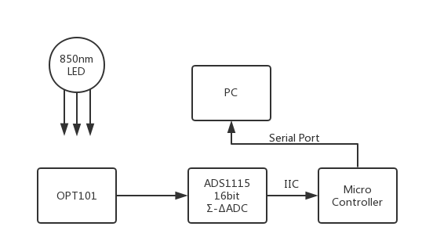
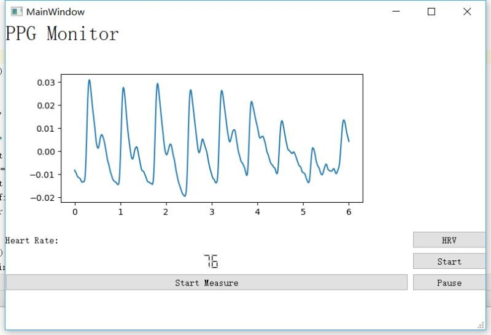
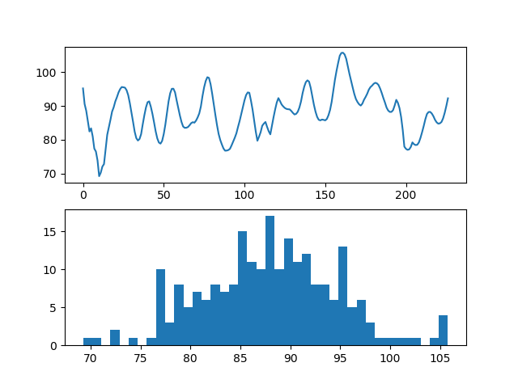

# PPG_Monitor
An PPG monitor program use ads1115 through arduino microcontroller.  
Communicate through USB serial port.

Features:  
Communication: Serial Port: Baud Rate: 115200  
GUI: programmed in PyQt5  
PPG wave display: use matplotlib  
Real time heart rate calculation: Pan Tompkins algorithm  
HRV(Heart rate variability) analysis: When stop collection, user could press "HRV" buttom to   
  plot n-t curve and histogram of heart rate. Result can be found in PC directory.

block diagram:  
  
GUI Main Window:  
  
HRV analysis:  

